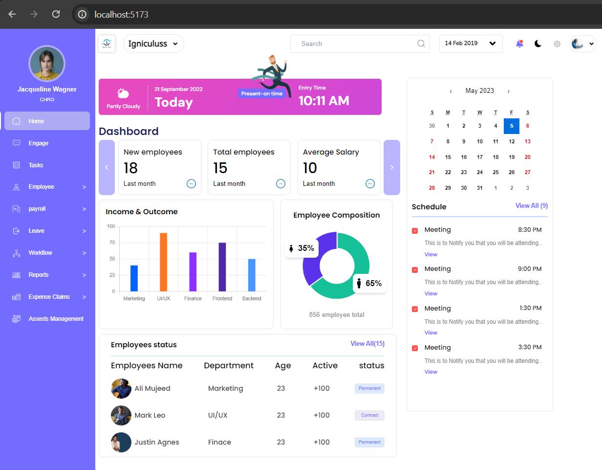

# dashboard figma design usign react and tailwindcss 
 
<a  href="https://dashboardfigmadesign24.netlify.app"> Live deployed Link </a>
 

<h1>description : </h1>

there is a dashboard page in page folder contains all components 

<ul> here all components line by line </ul>
<li>Sidebar</li>
<li>Navbar </li>
<li>Headbar</li>
<li>Sidebar</li>
<li>jobbar</li>

now here charts 

<li>  verticle bar chart : verticle bar chart contains income & outcome data </li>
<li> donutchart : donutchart contains female and male emplyees data </li>

Now here employee status details in EmployeeStatus component

celender details in Calenders component

